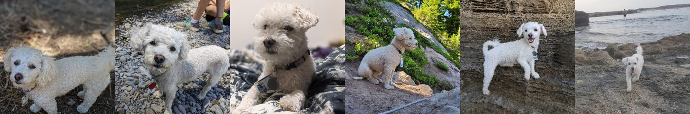

# TLab 2023. Domain-specific content generation

Решение тестого задания: 
- Изучение научной статьи с описанием метода DreamBooth
- Запуск решения и дообучение весов под выбранный домен

## Содержание
- [Изучение статьи](#изучение-статьи)
    - [Тема и проблематика](#тема-и-проблематика)
        - [Что это такое?](#что-это-такое)
        - [Почему над этим работают?](#почему-над-этим-работают)
        - [Как формулируется задача?](#как-формулируется-задача)
    - [Обзор статьи и решения](#обзор-статьи-и-решения)
        - [В чем ее основная идея?](#в-чем-ее-основная-идея)
        - [В чем ее новаторство?](#в-чем-ее-новаторство)
        - [Какие получились результаты?](#какие-получились-результаты)
- [Практическая часть](#практическая-часть)
    - [Набор данных](#набор-данных)
    - [Эксперименты](#эксперименты)
    - [Результаты экспериментов](#результаты-экспериментов)
    - [Отчет по воспроизведению результатов](#отчет-по-воспроизведению-результатов)
    - [Примеры генераций](#примеры-генераций)
    
## Изучение статьи

### Тема и проблематика

#### Что это такое?

Генерация контента под определенный домен - процесс создания контента под предметную область или отрасль, например, медицину финансы, технологии или любой другой специализированной области.  

Одним из решений является обучение модели под определенный домен с нуля, однако для него необходимы большие объемы данных и ресурсов. Вместо этого, более эффективным и экономичным подходом является fine-tuning общецелевых моделей натренированных на большом количестве данных и имеющих знания об окружающем мире. Этот метод позволяет быстро и адаптированно создавать контент для конкретного домена, используя уже существующие знания и структуру модели.

#### Почему над этим работают?

Целью создания контента для конкретной предметной области является создание высококачественного, релевантного и связного контента, соответствующего выбранному домену. 

Fine-tuning общецелевых моделей позволять сохранить существующие знания и углубить или приобрести новые знание в предметной области эффективно. 

Не всегда требуется дообучить модель под совершенно новую предметную область, иногда необходимо дать модели новые знание об ограниченном наборе объектов, а не адаптировать модель под новый домен. 

#### Как формулируется задача?

Задача заключается в том, чтобы добавить в домен новый объект. В процессе дообучения на новом объекте модель должна извлечь его свойства и быть способной генерировать этот объект в ранее невиданном контексте.

### Обзор статьи и решение

В статье данная задача решается в контексте генерации изображений.

#### В чем ее основная идея?

Основная идея исследования в том, чтобы модель научилась "связывать" уникальный идентификатор с данным объектом. 
Модель обучается на запрос с этим идентификатором генерировать изображение данного объекта. После чего обученная модель может генерировать данный объект в новом контексте.
Авторы обозначают новый объект как пару: новый идентификатор и класс объекта. И вводят регуляризацию для сохранения приора, чтобы новый объект не стал модой своего класса, и модель продолжала генерировать объекты данного класса так же, как и до дообучения.

#### В чем ее новаторство?

DreamBooth представляет новый метод для персонализации генеративных моделей. Она позволяет генерировать персонализированный концепт, обучившись на набольшом датасете неболее десятка изображений.

#### Какие получились результаты?

Авторы приводят метрики DINO и CLIP-I, которые показывают, что предложенный ими работают лучше, чем textual inversion (который не обучает модель на новых объектах, а представляет новый объект в существующем текстовом пространстве, то есть модель не получает новые знания, а описывает объект, исходя из имеющихся знаний). Результаты работы достойны, поставленная задача была решена, но у метода есть ограничения в случаях, когда модель "видела" недостаточно изображений класса, как у данного объекта, из-за чего не может корректно сгенерировать контекста, и, когда вероятность пересечения данного объекта и контекста мала и модель не понимает взаимосвязи между ними.

## Практическая часть

Я добавил комманду:
```bash
sed -i '493s/logging/project/' /content/lora/training_scripts/train_lora_dreambooth.py
```

### Набор данных
Для экспериментов я выбрал один из объектов, который был использован авторами - dog3, 6 изображений.


### Эксперименты

Эксперименты были проведены в Colab'e на видеокарте Tesla T4 16GB VRAM.

Первые эксперименты были проведены с целью получить минимально приемлемый результат, тогда же был подобран порядок для коэффициента скорости обучения (e-4 для unet и e-5 для text encoder). Дополнительно изучив гиперпараметры, решил оставить batch_size=1 для лучшей обобщаемости. Также решил, что steps=300 достаточно для минимально приемлемого результата. Также всех представленных мною экспериментах я обучал text_encoder.

В ходе первых экспериментов были обучены модели как и без prior preservation, так и с ним. Модели без prior preservation требуется меньше шагов, чтобы "запомнить" объект, однако она "забывает" другие объекта того же класса из-за чего метрикa DINO, но и PRES будет выше, а DIV ниже.

Для обучения модели с prior preservation я поставил больше steps=2000, так как запоминать новый объект она будет медленее, стараясь сохранить prior. Однако метрика DINO оказалась маленькой, значит модель не смогла выучить объект или регуляризации для prior preservation влияла на обучение сильнее.

По результатам этих экспериментов, оценив метрики и генерируемые изображения, выяснилось, что модели слишком плохо обучаются. Даже модели без prior preservation не всегда генерировали требуемый новый объект. 

Одним из возможных решений было увеличивать steps для модель без prior preservation и смотреть метрики, и увеличивая steps для модель с ним, подобрать prior_loss_weight. Однако времени и ресурсов не хватало и я изучил другие решения и реализации обучения DreamBooth с LoRA, и нашел блокнот в репозитории diffusers [train_dreambooth_lora.py](https://github.com/huggingface/diffusers/blob/main/examples/dreambooth/train_dreambooth_lora.py). Гиперпараметры в основном были такие же и несколько дополнительных, работать я решил с общими.

Оптимальные параметры для нового скрипта обучения были steps=500, lr=1e-4, gradient_accumulation_steps=2. Варьирую остальные параметры и оценивая метрики была выбрана наиболее успешная модель (выделена жирным).

### Результаты экспериментов

Эксперименты обученные с предложенным ноутбуком из репозитория [lora](https://github.com/cloneofsimo/lora/blob/master/training_scripts/train_lora_dreambooth.py).

| Описание эксперимента | PRES | DIV | DINO | CLIP-I | CLIP-T
|--- | --- | --- | --- | --- | --- |
| w/o PPL, steps=300, lr=5e-4, lr_text=6e-5, grad_accum=1, lr_sched=const, lora_rank=16 | 0.3196423 | 0.5589787364 | 0.32925552 | 0.730297 | 0.24568156
| w/o PPL, steps=800, lr=5e-4, lr_text=6e-5, grad_accum=1, lr_sched=const, lora_rank=16 | 0.34639186 | 0.5937337279 | 0.3557735 | 0.74170953 | 0.24260017 |
| w/ PPL, steps=2000, lr=5e-4, lr_text=6e-5, grad_accum=1, lr_sched=const, lora_rank=16, n_class_im=50 | 0.19029397 | 0.5717885494 | 0.24086858 | 0.72657603 | 0.24252593 |

Эксперименты обученные с ноутбуком из репозитория [diffusers](https://github.com/huggingface/diffusers/blob/main/examples/dreambooth/train_dreambooth_lora.py).

| Описание эксперимента | PRES | DIV | DINO | CLIP-I | CLIP-T
|--- | --- | --- | --- | --- | --- |
| __w/ PPL, steps=500, constant lr, rank=16, grad_accum=2, lr=1e-4, batch_size=1, prior_loss_w=1, n_class_im=200__ | 0.22252478 | 0.5189799666| 0.5051674 | 0.77529675 | 0.24541661 |
| w/o PPL, steps=500, constant lr, rank=16, grad_accum=2, lr=1e-4, batch_size=1 | 0.51517344 | 0.5368546843| 0.521899 | 0.77498657 | 0.24194836 |
| w/ PPL, steps=500, polynomial lr, rank=16, grad_accum=2, lr=1e-4, batch_size=1, prior_loss_w=1, n_class_im=200 | 0.20639181 | 0.5647251606 | 0.40241632 | 0.7358104 | 0.23995987 |
| w/ PPL, steps=500, constant lr, rank=32, grad_accum=2, lr=1e-4, batch_size=1, prior_loss_w=1, n_class_im=200 | 0.16710602 | 0.4927567542 | 0.4840748 | 0.7708441 | 0.23909402 |


### Отчет по воспроизведению результатов

Пункты 1-3 предстваляют обучение и инференс. Пункты 4-8 - получение метрик.

1. В разделе SETUP выполните все ячейки и выберите seed (я использовал 42). 
Репозиторий dreambooth был склонирован для получения датасета с изображениями dog3.

2. Выберите, каким скриптом обучения вы хотите воспользоваться, выберите гиперпараметры и запустите обучение. 

3. В зависимости от того, какой скрипт обучения вы выбрали, запустите ячейку для LOADING MODEL

4. Выберите живой ли объект для выбора списка промптов, которые использовали авторы.

5. Выберите названия папок, куда буду сохранятся сгенерированные изображение.

6. Выберите количество изображений на один промпт (авторы использовали 4).

7. Авторы измеряли метрики моделями DINO, CLIP, а также использовали LPIPS метрику. Использованные мною модели указаны по умолчанию, но при желании можно использовать другие.

8. Запустите ячейки для получения метрик.


### Примеры генераций

Результаты самой успешной модели.

|  |  |  |  |  |
| --- | --- | --- | --- | --- |
| a TOKEN dog with a blue house in the background | a TOKEN dog wearing a rainbow scarf | a TOKEN dog in a a TOKEN dog police outfit | a TOKEN dog wearing a yellow shirt | a TOKEN dog in a purple wizard outfit |

Интересные результаты других моделей.

|  |  |  | 
| --- | --- | --- | 
| a cube shaped TOKEN dog | a TOKEN dog wearing pink glasses | a TOKEN dog with a blue house in the background | 

Результат обучения получились достойными, модель выучила новый объект, не потеряв знания о старых. Результаты работы сопоставимы с результатами, которые публикуют другие люди.

## Бонусная часть

Я не совсем понял приведенный пример (и, к сожалению, не получил ответов на вопросы) и не ожидаю высокий оценки за эту часть, но приведенное мною решение выполняет поставленную задачу.
Я использовал Image2ImagePipeline, которая принимает промпт и изображение, на основе которых генерирует требуемое. 